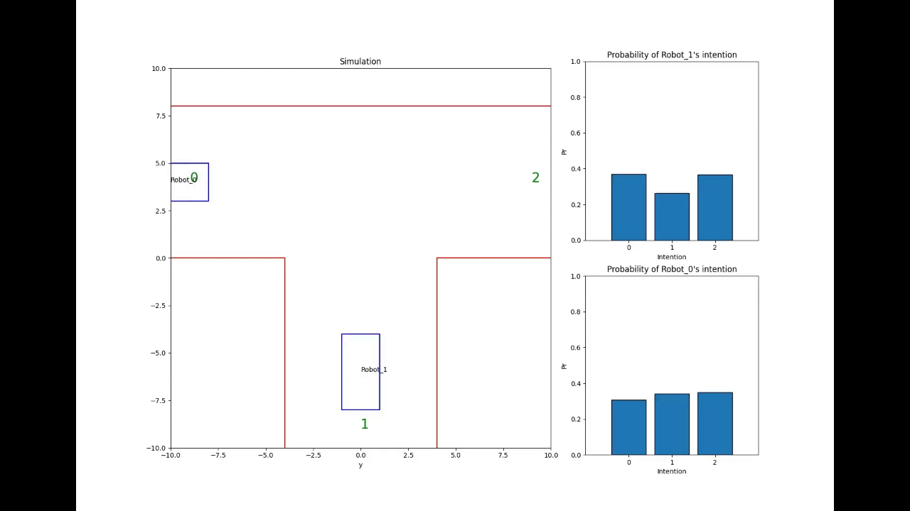
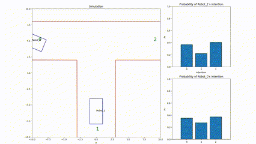
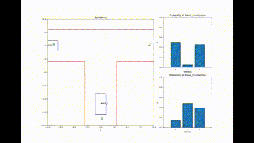

# mcts-robot

## 效果图







## build

```bash
mkdir build
cd build
cmake ..
cmake --build .
./mcts_solver
```

## 参考文献

1. Joint Multi-Policy Behavior Estimation and Receding-Horizon Trajectory Planning for Automated Urban Driving
